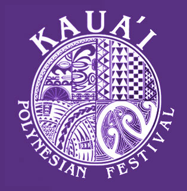

  

The Kauai Polynesian Festival is held every year at the end of May. It showcases the cultures of the Tahitian, Samoan, Hawaiian, and Maori people. My volunteer work had me helping to set up one of the workshops within the festival. Particularly the lei making workshop for the Hawaii section of the festival. During the festival, I was one of the instructors when tourists came by to learn how to make grass leis. Unfortunately, my own skills in lei making are rudimentary, having only learned how a few days prior. I was soon relegated to collecting tickets as people entered the festival. 

In this project, I was forced to step out of my comfort zone and expose myself to strange and new things. I learned a lot about the polynesian culture and broadened my world view. My personal skills were also improved, as I was able to meet new people and start up conversations with complete strangers over topics I knew little about. I learned that sometimes if you're not proficient at something you can still assist in other ways as long as you're willing to swallow your pride. 

